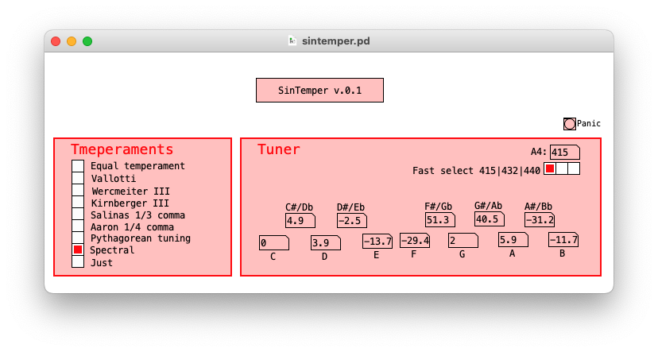

# SinTemper

**Afinación y temperamentos históricoa** es un texto elaborado pro los profesores Pablo Herrera y Diego Vázquez, texto éste que aborda la temática de la historia de las afinaciones en la música atravesada por los conceptos de *lo aristoxénico* y *los pitagórico* como ordenadores de las diferentes soluciones que a lo largo de los siglos se a dado al problema de la afinación musical.

**SinTemper** es un *patch* para PureData (Vanilla) que no deja de ser una extensión del texto de Herrera y Vázquez, extensión absolutamente necesaria si realmente se desea acometer el estudio de las afinaciones, porque pretender comprender esta temática exclusivamente desde lo teórico sin incorporar la experiencia auditiva es como pretender aprender a cocinar sin comer.

## Características
* Polifonía de 8 teclas
* 9 temperamento, a saber:
	* Temperamento igual
	* Vallotti
	* Wercmeister III
	* Kirnberger III
	* Salinas mesotónico 1/3 comma
	* Aaron mesotónico 1/4 comma
	* Afinación pitegórica
	* Escala espectral
	* Afinación justa
* Diapasón afinable entre 400 y 460 hz., con afinación rápida en 415, 432 y 440. 
* Botón de pánico (*panic*). El cambiar de afinación (por cualquier camino —modificando el diapasón, seleccionando un temperamento o afinando una nota en particular— mientras se está tocando una o más notas, producirá como efecto que dichas notas no se apaguen al soltar las teclas de la entrada MIDI. En esos caso, por favor, no entre en pánico y presione *panic*.	   

## Limitaciones de la versión actual
Por el momento, el sintetizador posee exclusivamente un *patch* de sonido sinusoidal, el cual es muy buena opción para el fin que este *software* tiene, pero también pretendemos, en un futuro cercano, incluir la opción de otros timbres, ya que somos conscientes de la influencia que tiene en la percepción de los intervalos y los acordes la complejidad iímbrica.

Un defecto que también será allanado en breve es el hecho de que, al elegir un temperamento distinto al temperamento igual, el *diapasón* (el la4 de referencia) se ve modificado según el desvío en *cents* que en tal temperamento posea la nota *la*.

Un faltante más: por el momento, todo está referenciado a una fundamental *do*. Elegir la fundamental del temperamento y evitar la movilidad del diapasón son, desde el punto de vista técnico, un único tema: reesctibir el patch de temperamentos.

